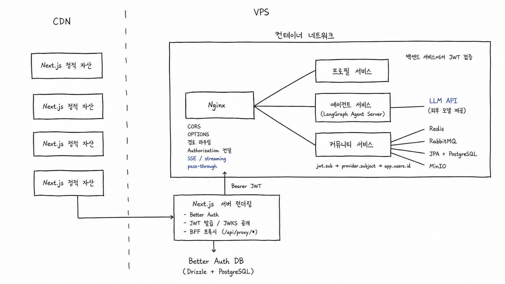

# 프로젝트 설명

Keycloak을 이용한 JWT 발급 및 Traefik을 이용한 MSA 프로젝트입니다.

## 실행법

- Docker 의 Deamon 이 설치되어 있어야 합니다.
- node, npm, python, uv가 설치되어 있어야 하며 java 21로 설정되어 있어야 합니다.
- `.env.example`을 참고하여 프로젝트 루트에서 make dev를 실행하면 compose가 빌드되고 localhost:3000으로 next.js의 클라이언트가 실행됩니다.

## MSA 기능 설명

- **인증서버**
  - Keycloak을 이용하여 OAuth 2.0 및 OpenID Connect 기반으로 JWT 토큰 발급 및 통합 인증을 처리합니다.
- **게이트웨이**
  - Traefik을 사용하여 API 라우팅을 자동화하며, Docker Compose Label 기반으로 서비스들을 게이트웨이에 동적 등록합니다.
  - 별도의 디스커버리 없이 Docker Compose Label 을 사용하므로 신규 서비스 등록시 참고.
- **프론트엔드**
  - 프론트엔드 next.js에서 클라이언트 요청을 프록시합니다.
  - orval을 통해 zod, react suspense query 등을 swagger와 연동하여 생성합니다. Traefik에서 발신하는 Docker Compose Label을 참조합니다.
- **frontend/orval.config.ts. docker-compose.yml, Makefile**
  - MSA 아키텍처 구성을 위해 필요한 빌드 설정들입니다. Traefik 게이트웨이를 띄워야 아키텍처가 정상 동작합니다.
- backend/services/echo-service
  - Traefik 내부에서 다른 서비스를 호출하는 예시가 포함되어 있습니다.
- **backend\services\community-service**
  - JWT 토큰을 소비하여 유저 테이블에 새로운 유저 데이터를 삽입하는 예시, JWT를 통한 인가로 CRUD하는 예시가 포함되어 있습니다.
  - REDIS를 이용한 캐싱과 RabbitMQ를 이용한 비동기 작업이 포함되어 있습니다.

## 에이전트

LangGraph Agent Server로 V2 Stream Events를 열고, 프론트엔드에서 @Langgraph/react 로 소비

- **도구호출**
  - LangGraph를 이용한 Low Level 하네스를 구현하여 Tool Call Loop 구현
  - 관련 파일 :
    - [graph.py](backend/services/agent-service/src/agent/services/chat/graph.py) : 저수준 StateGraph 및 노드/엣지 정의
    - [nodes.py](backend/services/agent-service/src/agent/services/chat/nodes.py) : chat model 호출 및 도구 바인딩 노드
    - [langgraph-chat-stream-provider.tsx](frontend/src/features/llm-chat/hooks/langgraph-chat-stream-provider.tsx) : `@langchain/react` useStream SSE 스트림 및 상태 관리
    - [build-tool-call-view-model.ts](frontend/src/features/llm-chat/lib/langgraph/build-tool-call-view-model.ts) : 도구 호출 상태를 UI용 뷰 모델로 조립

- **Permissions & HITL**
  - 클라이언트 측에서 context를 주입하도록 구현
  - context에 따라 인터럽트 후 사용자 피드백 전송하도록 HITL 구현
  - 관련 파일 :
    - [nodes.py](backend/services/agent-service/src/agent/services/chat/approvals/nodes.py) : 승인 게이트(`approval_gate`) 및 승인된 도구 실행 노드
    - [policy.py](backend/services/agent-service/src/agent/services/chat/approvals/policy.py) : 사용자 컨텍스트 기반 도구 승인 필요 여부 판정 정책
    - [langgraph-chat-stream-provider.tsx](frontend/src/features/llm-chat/hooks/langgraph-chat-stream-provider.tsx) : 인터럽트 수신 및 `stream.respond`를 통한 사용자 피드백(HITL) 전송
    - [build-submit-config.ts](frontend/src/features/llm-chat/lib/langgraph/build-submit-config.ts) : allowed_tools 및 interrupt_on 컨텍스트 설정 생성

- **Evals**(진행중)
  - AI Agent와 하네스를 실제로 호출하여 테스트 시나리오를 통과하는지 검증
  - (진행중) Lagacy Stream 에서 V2 Event Stream으로 전환 필요
  - 관련 파일 :
    - [client.py](backend/services/agent-service/evals/agent_eval/client.py) : Protocol V2 기반 SSE 스트림 및 커맨드 전송 HTTP 클라이언트
    - [runner.py](backend/services/agent-service/evals/agent_eval/runner.py) : 평가 시나리오 실행 및 인터럽트 재개 처리 흐름 제어
    - [sse.py](backend/services/agent-service/evals/agent_eval/sse.py) : 평가 검증용 SSE 프레임 파서 및 유틸리티
    - [validators.py](backend/services/agent-service/evals/agent_eval/validators.py) : 실행 이벤트 및 작업 결과 검증 모듈
