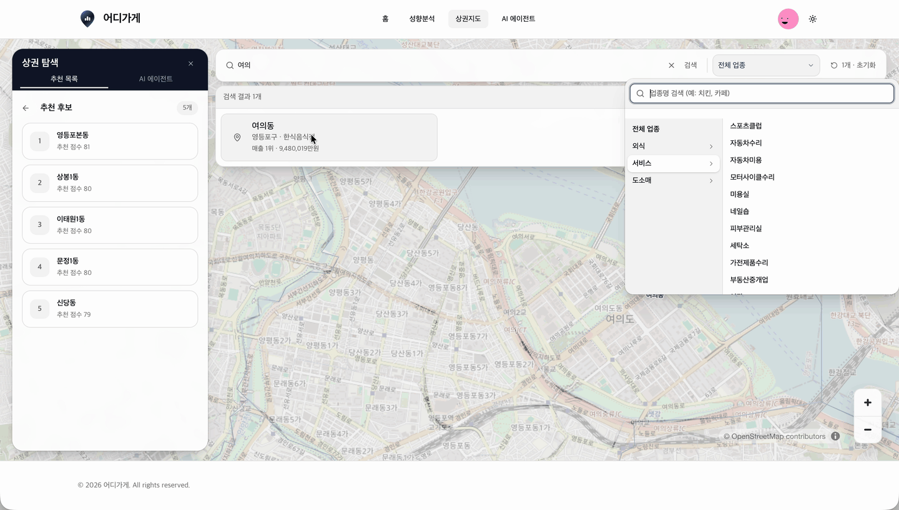
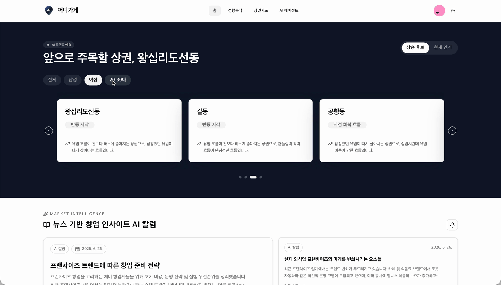
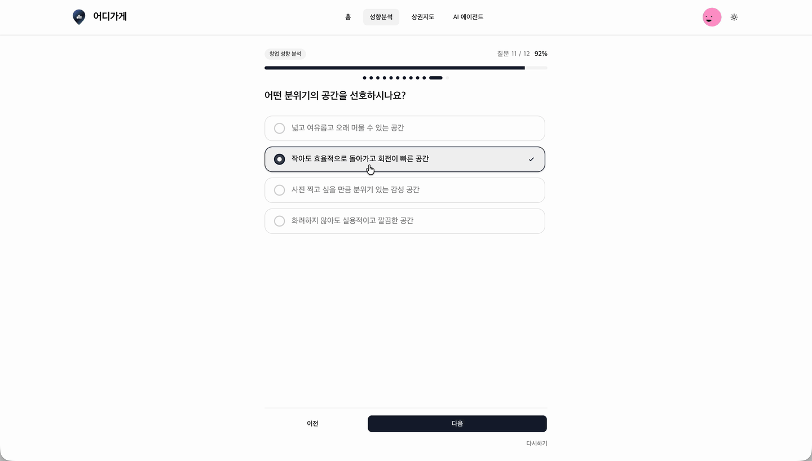
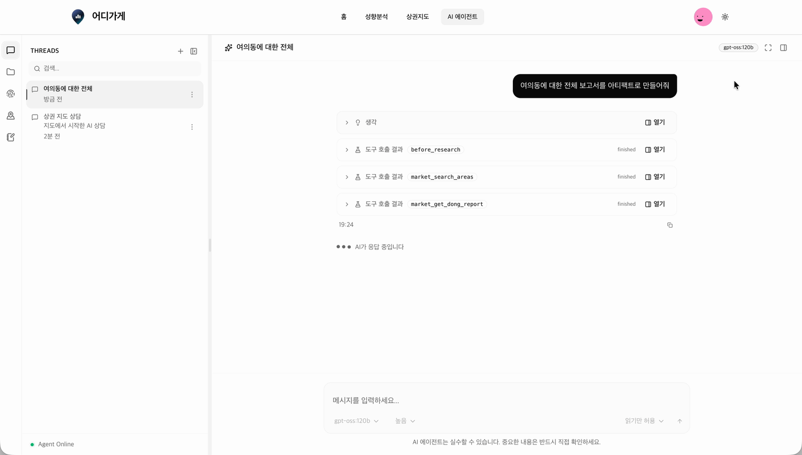
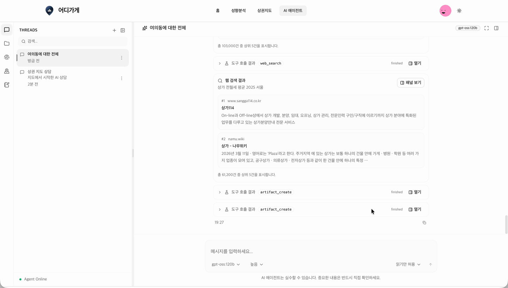
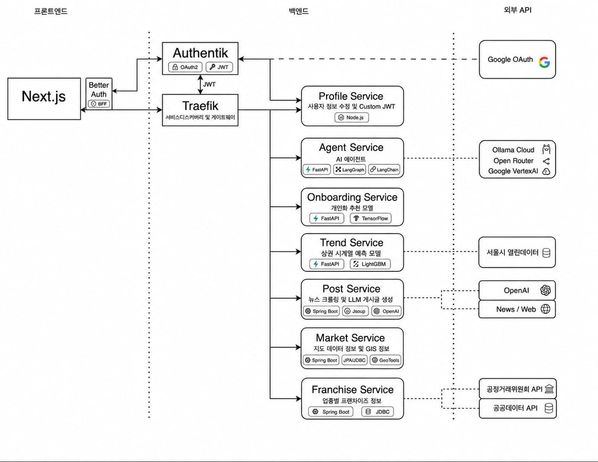

# 🍔 어디가게 🍽️

## 🏪 '어디가게' 소개


<br />

<span style="color:#FF9393; font-size:18px">어디에 가게를 차릴지 고민하는 사장님들을 위해</span>
<br />
`어디가게`는 자영업을 시작하려는 예비사장님들을 위해 태어났습니다. <br/>
사장님들에게 맞는 맞춤형 업종 추천 및 상권 추천 서비스를 경험하세요. <br/>
AI 에이전트와 함께 나의 다음 가게를 찾아보세요. <br />

- **배포주소**: [https://market-fit.jongchoi.com/](https://market-fit.jongchoi.com/)
- **주요 기술스택** : PostGIS, LangGraph Agent Server, LightGBM, TensorFlow Recommenders

## 🏪 프로젝트 기간 [ 2주 ]

**2026.06.15(월) ~ 2026.07.01(수)** <br/>

- **서울시 매력일자리 사업**  
  AI Agent 기반 웹 시각화 개발 실무 및 취업 과정  
  (한국스마트빌리지협회)
  <br />

## 🏪 참여 인원 및 역할 분담

- **최종현** | ML/AI | 풀스택 | <br/>
  팀장 | 아키텍처 설계 | AI 에이전트 서비스 | Two-Tower 기반 추천 서비스

- **김윤지** | 풀스택 | <br/>
  상권 트렌드 예측 서비스 | 지도 페이지 Frontend

- **오수진** | 백엔드 | <br/>
  상권 데이터 DB | 업종 및 프랜차이즈 DB

- **변우주** <br/>
  웹 크롤링 | 트렌드 리포트 서비스

## 🏪 기능 소개

### 메인 랜딩 페이지

<span style="color:#FF9393">AI 트렌드 예측 배너와 추천 서비스 진입 CTA를 메인 화면에서 바로 확인할 수 있습니다.</span><br /><br />

<br />

- **상권 트렌드 예측 모델**
  - LightGBM 기반 예측 모델을 사용해 최근 흐름, 변동성, 반등 신호, 상업시간대 유입 비중 등을 반영합니다.
  - 예측 결과는 전체, 남성, 여성, 20·30대 세그먼트별로 나누어 배너에 표시됩니다.
- **크롤링 기반 리포트 생성**
  - `post-service`는 뉴스/검색 URL을 입력받아 관련 기사 본문을 수집합니다.
  - 수집된 내용 중 상권, 창업, 프랜차이즈와 관련된 문단을 선별해 OpenAI API를 통해 리포트를 생성합니다.

### AI 추천 설문 및 창업 성향 분석

<span style="color:#FF9393">온보딩 설문을 통해 사용자 성향에 맞는 업종과 상권 추천 흐름을 제공합니다.</span><br /><br />

<br />

- **Two-Tower 기반 추천 구조**
  - TensorFlow Recommenders를 사용하여 사용자 성향과 상권 후보를 매칭한 Positive Pair로 Two-Tower 모델을 학습시켰습니다.
  - 업종 추천 모델은 업종 코드, 업종명, 추천 점수 등 17개 파라미터, 상권 추천 모델은 매출 규모, 주말/저녁 매출 비중, 거주인구 등 9개의 파라미터를 사용합니다.
  - 32차원 벡터를 이용해 top-k를 선정하며, 점수는 Recharts를 통해 렌더링합니다.

### 지도 기반 상권 탐색 및 리포트

<span style="color:#FF9393">지도에서 후보 상권을 탐색하고, 필터와 결과 패널을 기준으로 상권 정보를 비교할 수 있습니다.</span><br /><br />


<br />

- **OpenStreetMap + MapLibre 지도 렌더링**
  - `market-service`는 PostGIS를 이용해 지리 정보를 관리하고 행정동 경계를 GeoJSON 형태로 제공합니다.
  - 프론트엔드는 MapLibre GL을 사용해 지도 인터랙션을 구현합니다.
  - 배경 지도는 OpenStreetMap raster tile을 사용하고, 그 위에 행정동 폴리곤 레이어를 올려 상권 탐색 화면을 구성했습니다.

- **지도 쿼리 Tool 호출**
  - 에이전트는 필요한 경우 지도/상권 관련 Tool을 호출해 `market-service`의 상권 데이터 API를 조회합니다.
  - SSE에서 `market-service` 도구 호출을 감지하면 setQueryData()로 지도의 검색어를 변경하여 인터랙션합니다.

### AI 에이전트 기반 상권 분석

<span style="color:#FF9393">대화형 에이전트가 상권 맥락을 읽고 추천, 질문 응답, 후속 탐색을 지원합니다.</span><br /><br />


<br />

- **LangGraph 기반 Tool Calling 루프 하네스**
  - `agent-service`는 LangGraph `StateGraph`로 에이전트 실행 흐름을 구성합니다.
  - 에이전트는 `market_*`, `franchise_*`, `onboarding_*` 과 같은 어디가게의 서비스를 30여 개의 도구로 JWT 인증과 함께 호출합니다.
  - 사용자별 장기 메모리, 사용자가 컨텍스트에 추가한 문서 등을 메시지 배열의 마지막 메시지에 동적으로 추가하여 Prefix Cache를 유지하면서도 LLM이 맥락을 파악하도록 컨텍스트 엔지니어링하였습니다.

- **`@langchain/react` 호환 API 및 Human-in-the-loop**
  - `agent-service`는 `@langchain/react`와의 연동을 위해 LangGraph Agent Server V2와 호환되는 API를 제공합니다.
  - Tool Spec에 기반하여 도구 호출 권한을 설정하고, 승인이 필요한 도구는 사용자의 응답이 올 때까지 interrupt 후 사용자 응답과 함께 checkpoint 기반으로 복원합니다.
  - 에이전트의 응답값은 Recharts를 렌더링할 수 있는 커스텀 마크다운 렌더러와 함께 마크다운으로 렌더링됩니다.

## 🏪 개발환경

- 상당수의 코드를 AI 에이전트와 함께 생성하였습니다. [AGENTS.md](./AGENTS.md)를 진입점으로 두고, AI 에이전트가 각 서비스별 AGENTS.md 및 docs 폴더를 통해 점진적으로 코딩 컨벤션과 프로젝트 구조를 파악하도록 의도하였습니다.
- 생성된 PR은 AI 에이전트를 통해 코드리뷰를 받을 수 있도록 깃허브 액션을 구성하였습니다. [code-review.yml](./.github/workflows/code-review.yml)에서 Self-Hosted Runner를 통한 Codex 코드 리뷰 액션을 확인하실 수 있습니다.
- 일정 및 이슈 관리는 GitHub 프로젝트의 칸반 보드를 통해 관리되고 있습니다. [market-fit-team/projects](https://github.com/orgs/market-fit-team/projects/2)에서 확인하실 수 있습니다.
- 프론트엔드 코드 제너레이터인 Orval을 통해 Zod, React Query를 자동으로 생성합니다. 로컬 환경을 위한 도커 설정은 [docker-compose.yml](./docker-compose.yml), Orval을 통해 OpenAPI Docs를 발견하고 코드를 생성하는 설정은 [frontend/orval.config.ts](./frontend/orval.config.ts)에서 확인하실 수 있습니다.

## 🏪 아키텍처



**Traefik**을 서비스 디스커버리 및 리버스 프록시로 사용하는 MSA 아키텍처입니다.
인증서버 **Authentik**을 이용한 JWT 인증/인가를 사용하며, 서버 간 통신은 REST를 사용합니다.

- Docker Compose
- GitHub Actions
- Oracle Cloud Infrastructure
- Traefik : 서비스 디스커버리 및 게이트웨이
- Authentik : OAuth 및 JWT 인증 발급

## 🏪 기술스택

### 프론트엔드

- **개발환경:** Next.js 16.2 (standalone), Vitest
- **상태관리:** Zustand, TanStack Query
- **UX/UI:** Shadcn/ui, Recharts, MapLibre GL
- **API:** Orval, Zod, @langchain/react

### Agent Service

- **런타임/프레임워크:** Python, FastAPI, LangGraph Agent Server
- **Agent Framework:** LangGraph, LangChain
- **데이터베이스:** SQLAlchemy Async
- **개발환경:** uv, Pytest, Ruff, Pyright

### Trend Service

- **런타임/프레임워크:** Python, FastAPI
- **데이터/ML:** LightGBM, Pandas, NumPy
- **데이터베이스:** SQLAlchemy, PostgreSQL, psycopg
- **설정/서빙:** Pydantic, Uvicorn
- **개발환경:** Pytest, Ruff

### Onboarding Service

- **런타임/프레임워크:** Python, FastAPI
- **데이터/딥러닝:** TensorFlow Recommenders, NumPy, Pandas
- **데이터베이스:** SQLAlchemy Async, PostgreSQL
- **도구/설정:** uv, Pydantic

### Market Service

- **런타임/프레임워크:** Java 21, Spring Boot 3.5
- **데이터베이스:** PostgreSQL, Flyway, Spring Data JPA, Spring JDBC
- **API/문서화:** Spring Web, Spring Validation, SpringDoc OpenAPI
- **공간 데이터 처리:** GeoTools, Apache Commons CSV

### Franchise Service

- **런타임/프레임워크:** Java 21, Spring Boot 3.5
- **데이터베이스:** PostgreSQL, Flyway, Spring JDBC
- **API/문서화:** Spring Web, Spring Validation, SpringDoc OpenAPI

### Post Service

- **런타임/프레임워크:** Java 21, Spring Boot 3.5
- **데이터베이스:** PostgreSQL, Flyway, Spring Data JPA
- **크롤링/LLM:** Jsoup, OpenAI API
- **API/문서화:** Spring Web, Spring Validation, SpringDoc OpenAPI

## 🏪 프로젝트별 파일 구조

### Frontend

**Feature-based** 폴더 구조를 사용합니다

```text
frontend
├── src
│   ├── app                  # App Router 진입점 / 전역 provider / route handler
│   │   ├── agent
│   │   └── report
│   ├── features             # feature-based domain modules
│   │   ├── agent
│   │   └── trend
│   ├── shared               # 공통 API / UI / config / lib / utils
│   │   ├── api
│   │   ├── components
│   │   ├── config
│   │   ├── lib
│   │   └── utils
│   └── testing
├── e2e
├── .storybook
└── docs
```

### Java Services

`market-service`, `franchise-service`, `post-service`는 `api / application / core / infrastructure` 구조를 사용하는 **Domain-Driven Design** 폴더 구조를 사용합니다.

```text
service
├── src/main/java/com/.../{service}
│   ├── api                  # Controller / Request DTO / Response DTO
│   ├── application          # Use case / Query service / Application service
│   ├── core                 # Domain entity / domain model / business rule
│   └── infrastructure       # DB, 외부 연동, persistence 구현
├── src/main/resources
│   └── db/migration
└── src/test/java
```

### Python Services

Python 서비스들은 공통적으로 `api / core / db`를 기준으로 레이어를 나눈 **layered architecture**를 사용합니다.

```text
service
├── app or src/{service}
│   ├── api                  # FastAPI route / dependency / request entrypoint
│   ├── core                 # settings / config / 예외 / 공통 런타임
│   ├── db                   # session / model / persistence 기본 설정
│   ├── clients              # 내부 서비스 호출
│   ├── repositories         # persistence access 분리
│   └── schemas              # request / response schema
├── tests                    # unit / integration 테스트
└── docs                     # 구현 문서
```
